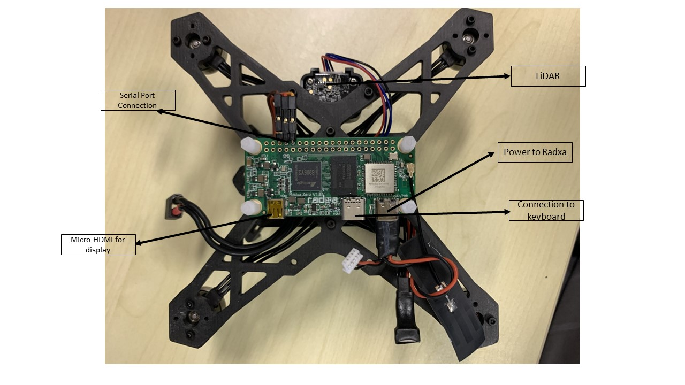
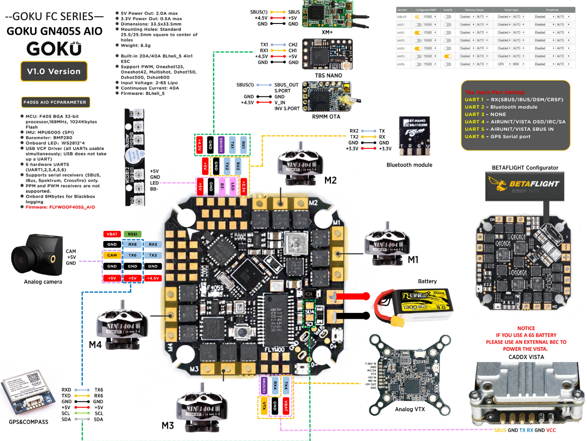
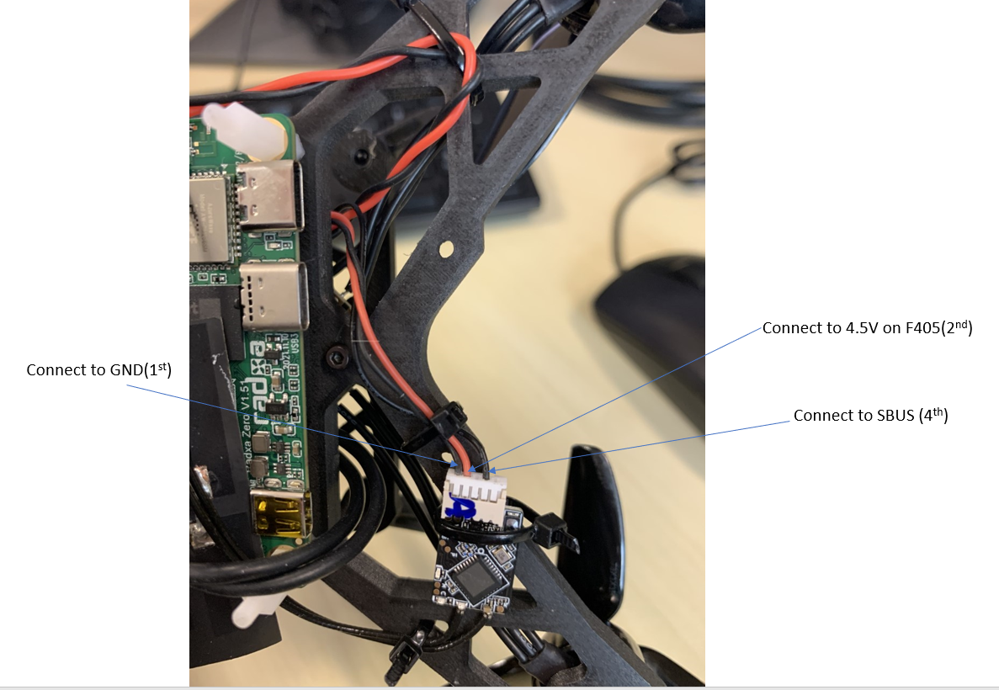
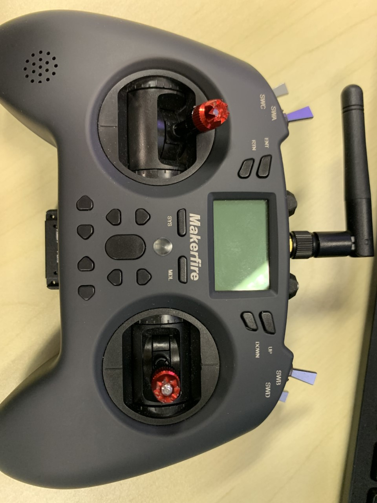

## Building SAFMC Drone

### Components Required

These are the components required to build a SAFMC Drone

1. Radxa-zero - This is the Radxa Zero onboard computer (OBC) that has already been mounted on the drone structure.


2. Flight controller (F405 Flywoo) - This is the low level controller that contains the PX4 software which will then drive the motors.


:::note 
On the OBC there's the antenna which needs to be attached, otherwise could have surge in power and spoil the OBC.
:::

### Hardware Fix

These are some of the steps required to get the hardware set-up

1. Need to solder red wire to 5V and black wire to GND and a USB C connector. Then heat shrink for final touch
2. The serial port pins (the three pins on the Radxa) need to be soldered onto the OBC (see Fig. \ref{obc})


:::note 
Last time, the OBC was driven directly by the battery pack. However, now they are going to use the output tapping points of the flight controller to draw 5V to the OBC. (see Fig. \ref{pinout} which shows the 5V and GND pinout.).
:::

### Software Fix

#### Radxa Setup

Flashing the Ubuntu OS into the OBC via eMMC. eMMC is like a non-volatile storage device. There is also another way of flashing using microSD card. An introduction is listed here: `https://wiki.radxa.com/Zero/getting_started`. For flashing using eMMC, follow the website closely `https://github.com/matthewoots/documentation/blob/main/radxa-zero/radxa-flash-backup-image.md`.

1. You need to flash using a ground laptop/workstation. Follow `https://github.com/matthewoots/documentation/blob/main/radxa-zero/radxa-uboot-usb.md`.The boot-g12.py comes from the package pyamlboot which you were told to install in the documentation. Note that you need to press the boot button before connecting the Radxa to your PC. The boot button is a USB-boot button, which means booting from USB. I think you can think of this similar to when you want to set-up a new comp with a new OS and you have a bootable USB device. When you don't have any OS in your comp, when you power up, only the boot loader will load and bring you to BIOS. Think this is something similar. It just means you want to boot up your Radxa. But I can't figure out why there is a need to do the boot-g12.py step. 
```bash
sudo apt install pip3
sudo pip3 install pyamlboot
# Press the boot button before connecting the PC to the Radxa Zero. Check here for picture of boot button `https://wiki.radxa.com/mw/images/e/e2/Radxa_zero_ports.jpg`
lsusb
# lsusb should show Armlogic, Inc. GX-CHIP
# You should download the rz-udisk-loader.bin from the the files folder in this repo
sudo boot-g12.py <path to rz-udisk-loader.bin>    # Get from `https://github.com/matthewoots/documentation/blob/main/files/rz-udisk-loader.bin`
```
2. Need to get a image burner. Get balenaEtcher
```bash
# Go and get Balena Etcher at https://github.com/balena-io/etcher/releases
# or you can get this release link for v1.7.9
cd Downloads
wget https://github.com/balena-io/etcher/releases/download/v1.7.9/balenaEtcher-1.7.9-x64.AppImage 

sudo chmod +x balenaEtcher-1.7.9-x64.AppImage
./balenaEtcher-1.7.9-x64.AppImage
# Load the image onto the board
```
3. Find the correct image in \url{https://github.com/radxa/debos-radxa/releases} Get this version radxa-zero-ubuntu-focal-server-arm64-20220804-0400-mbr.img.xz (this version has been tried and tested and compatible with existing software used in TLab).
4. To flash, first press the boot button at the underside of the Radxa. Then connect the OBC's power port to the USB connection (find the required cable to do this connection) of your ground laptop/workstation. Launch balena and it should be able to detect that you have a device connected to a USB. Flash the ubuntu through that USB port.


Once the OBC is flashed, then when you power on the OBC, it will now run the Ubuntu os.To start up Radxa standalone, you need to:

1. Plug in the power port from an external power supply
2. Connect the keyboard 
3. Connect micro HDMI from the OBC to a monitor
4. Once started up, username and password are 'rock'

#### Connecting to wifi

Instructions taken from `https://www.linuxfordevices.com/tutorials/ubuntu/connect-wifi-terminal-command-line`. But essentially the following steps:

1. Run the following command to check SSID: `nmcli dev wifi list`
2. Run the following to connect to specified network: `sudo nmcli --ask dev wifi connect <SSID>`
3. Password will be prompted. Key in password and should be good to go
  
Connecting to wifi in NUS is a problem because NUS network requires your username in addition to the SSID. To make things simpler, get a router to provide the SSID.

1. Get a router and connect the router via ethernet to the NUS network
2. Use your own laptop/desktop to connect to the router's SSID and password. It will then prompt you to key in your NUS details (NUS user name and password). After this, the router connection to NUS will be set up.
3. Then now you can use the above method to connect the Radxa to the router. 


#### How to startup Radxa tereminal on Your Laptop/Desktop's OS

Because Radxa has no GUI, it might be better to run the Radxa's terminal on top of an existing desktop OS like Ubuntu. So that you can copy and paste and browse the web. So what you need is the following:

1. You need to connect the serial debug port on the Radxa to a USB for communication with the desktop. (Don't connect the power supply to the board yet).
2. Download minicom, which is a software that can be used to communicate with Radxa through serial port. see `https://wiki.radxa.com/Zero/dev/serial-console`. In general the steps are:
  2.1 Add current user to the plugdev group so that can access serial device without root permission.
  2.2 Then edit bashrc with alias minicom and default settings
  2.3 Run the command 'minicom zero'
  2.4 After running, you can press Crtl+X and then followed by z to set configurations.
```bash
# Download Minicom
sudo apt-get update
sudo apt-get install minicom
#First let's add the current user to plugdev group so we can access serial device without root permission.
sudo usermod -a -G plugdev $USER
# Edit your ~/.bashrc and add the following line so minicom will always be launched with the following default setting
alias minicom='minicom -w -t xterm -l -R UTF-8'

#Login to a new terminal to for the change to take effect.
#Create and edit file ~/.minirc.zero with the following content:
pu port             /dev/ttyUSB0
pu baudrate         115200
pu bits             8
pu parity           N
pu stopbits         1
pu rtscts           No

#Now executing minicom zero will use the config above, and connect to Radxa Zero's serial console.
```
3. With the above steps, you can then plug in your power supply to power up the OBC. Minicom should be able to auto detect the OBC and display the OBC's terminal on the terminal that you ran Minicom.
4. So in a way this feels like an SSH. You can now control the OBC from your existing main OS.

#### Installing ROS and MAVROS

So with internet setup, you can now install ROS and MAVROS. To install ROS Noetic, go to `http://wiki.ros.org/noetic/Installation/Ubuntu`. To install MAVROS, go through the instructions listed here `https://docs.px4.io/main/en/ros/mavros_installation.html`

:::note 
You can choose other versions but the lab codes are currently tested with Noetic
:::

#### Creating Access Point

There's a need to create an access point from radxa. Do the follow steps as introduced in `https://github.com/matthewoots/documentation/blob/main/radxa-zero/radxa-remove-autoboot-countdown.md`. I think what this is doing is that because at the end of the tutorial, we would ideally have the serial port of the OBC connected to the flight controller. When we power on the OBC, what the bootloader will usually do is that it will keep do a countdown and check for any disruption. So if we have the serial port of OBC connected to the flight controller, then there will be some input signal going to the serial port and hence keep disrupting the bootloading process. Therefore the OBC cannot boot up.

So the instructions tries to go into fastboot mode, which means don't do a count down and just immediately boot up. Which means you have to amend the config file to the bootloader. Remember that at the start of the tutorial, we flash the Ubuntu OS into eMMC, which is a non-volatile storage device on the OBC? Similarly, this bootloader is also stored in the eMMC. So how should we amend this config file? We have to clone the bootloader from the radxa github page, rebuild the binaries, ie `u-boot.bin` and then replace the u-boot.bin file in the eMMC (which is the `dd` step in the instruction).

1. To follow the steps, you need to clone a u-boot.git and then change a config file according to the instructions in the provided github page. However, you will realize that there is no such config file because the repo is updated. Need to rollback to an older version. `git checkout origin/radxa-zero-v2021.07`. Follow the rest of the steps in the instructions and it should work.

#### SSH into Radxa and going headless (No more debug port connection)

There is a need to go headless because right now, the serial port is being used as a debug port (meaning that it can be connected to a ground laptop for debugging purposes). However, since the serial port is being used as a debugging port, you can't use it as a communication port to the flight controller. Because utimately, the flight controller and OBC are communicating via this same serial port. So You have to disable this port on the OBC as a debug port.

But first, we will setup SSH first. 

To set up SSH, there is a need to do the following:

1. Make sure that the ground laptop or workstation is connected to the same network as your OBC. In this case, if you are in NUS, then they have to be connected to the same router. 
2. You can either do this by using Minicom or you can use the method of using a micro HDMI to enter the Radxa terminal.
  2.1Not sure if this step is necessary but might need to enable password authentication by changing config file of the ssh. Go into ssh config file by the command `nano /etc/ssh/sshd_config` and change password authentication to yes and challengeresponseauthetication to no. Then restart your ssh with `sudo systemctl reload sshd`
3. Check the ip address assigned to your obc by doing ifconfig.
4. Make sure that you ground laptop can ssh as well.
5. Then do the following command `ssh rock@{localhost}` where `localhost` is the ipaddress of the OBC. This will prompt you for the password, which is rock.

Then now to go headless, you would need to go to nano /boot/uEnv.txt of the OBC and remove the line with `console=ttyAML0,115200`. I think this ttyAML0 refers to the specific serial port which you are debugging from. Removing this line means that you do not using this port as a console anymore.

#### Connecting to QGroundControl

QGroundControl can be paired with any flight controller that has PX4 installed. In this case, the flight controller has PX4 installed. I think there are a few ways of connecting QGroundControl, seems like wifi etc works. But at the bottom of the flight controller there is a micro USB B connector. Use that to connect the flight controller to the QGroundControl app. Seems like detection is automatic. Then you can see the parameters of the flight controller etc. Can play around with it.

#### Connecting RF receiver to the Flight Controller

Refer to figure below and you can see some pinouts stating 4.5V, GND and SBUS. Solder the wires to a connector such that you can connect it to the RF receiver.


Then refer to the figure below and you can see how the wires should be connected to the connector. Once done, you can plug the RF receiver to the connector accordingly. 



With that, you can set up the remote control (in this case we are using the remote control as seen below) to pair with the RF receiver. There is a button on the RF receiver which you can press. Press and hold it while you plug in the USB-b connector to the flight controller (F405). Then go to QGroundControl.

There is also a need to check which channel the RF is communicating on (ie SBUS). There should be a blue light on the receiver if so. If not, there is a need to configure it to comms via SBUS. On the RF packaging there should be a manual. Look at the manual for more instructions.

To check if the receiver is connected, go to QGroundControl and go to the radio tab to check if the flight controller responds to the control movements.



To connect the controller to the RF receiver, set the profile first, then go bind the receiver to the controller.

### Flashing the PX4 firmware to the AIO Flight Controller

Go to the following URL `https://github.com/matthewoots/PX4-Autopilot`. Checkout at the branch  `f405-v1.13.0`. Note that this is different from the official PX4-Autopilot in the sense that in `boards` folder, there is a board file catered specifically for f405 flight controller. 

so perform the following:
```bash
#Connect your F405 to the QGroundControl (via wifi or USB)
git clone https://github.com/matthewoots/PX4-Autopilot.git
git submodule update --init --recursive
make flywoo_f405s_aio upload #if you want to upload directly to the F405. Make sure QGroundControl is closed. There can only be one port communicating at one time. If just want the build files, then just do `make flywoo_f405s_aio`
```

### Additional Resources

`https://github.com/radxa/documentation/tree/master/rs102`
